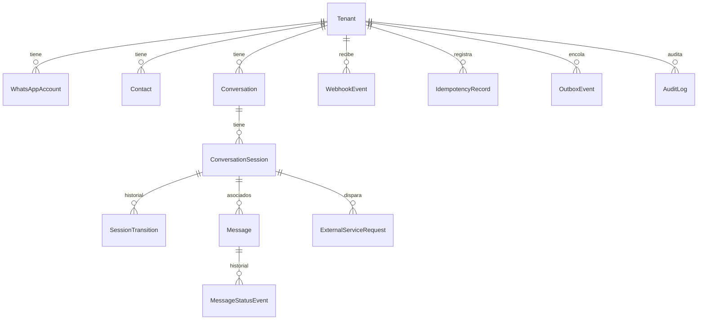

# Arquitectura conversacional

Este documento describe el backend conversacional del bot de WhatsApp: modelo de datos, máquina de
estados, sesiones, concurrencia, idempotencia y la integración con el backend externo de facturación.

## 1. Responsabilidad del backend

Este servicio es responsable de:

- Recibir y persistir webhooks de WhatsApp (Meta Cloud API).
- Registrar mensajes entrantes y salientes, y su estado de entrega.
- Administrar conversaciones, sesiones y el estado de cada flujo conversacional.
- Validar el formato de los datos que el usuario va ingresando (no su validez fiscal).
- Invocar al backend externo de facturación para emitir/consultar facturas y notas de crédito.
- Garantizar que ningún mensaje, webhook u operación de facturación se procese dos veces.

## 2. Límites con el backend fiscal

Este backend **no** implementa: generación de XML, firma digital, CDC, QR tributario, certificados,
lotes SIFEN, envío a SIFEN, numeración oficial, ni cálculo tributario definitivo. Toda esa
responsabilidad es del backend externo de facturación (`BILLING_BACKEND_BASE_URL`).

Lo único que este backend conserva de una operación fiscal es un **puntero**: `externalResourceId`
(número/CDC devuelto), el payload de respuesta saneado, y el estado resumido de la llamada
(`ExternalServiceRequest`). Nunca es la fuente de verdad de una factura o nota de crédito.

## 3. Modelos



| Modelo | Rol |
|---|---|
| `Tenant` | Empresa. Todo dato conversacional cuelga de un tenant. |
| `WhatsAppAccount` | Número/cuenta de WhatsApp conectado a un tenant. |
| `Contact` | Persona que escribe al bot (`tenantId + waId` único). |
| `Conversation` | Hilo general entre una cuenta y un contacto. No guarda el paso actual del flujo. |
| `ConversationSession` | Una ejecución concreta de un flujo. El modelo más importante — ver §5. |
| `SessionTransition` | Historial append-only de cada cambio de estado/paso de una sesión. |
| `Message` | Mensajes entrantes y salientes, con estado de entrega. |
| `MessageStatusEvent` | Historial completo de callbacks de estado de WhatsApp. |
| `WebhookEvent` | Toda entrega de webhook, persistida antes de procesarse. |
| `ExternalServiceRequest` | Cada llamada al backend de facturación, con idempotencyKey propia. |
| `IdempotencyRecord` | Ledger genérico de idempotencia por `(tenantId, scope, key)`. |
| `OutboxEvent` | Transactional outbox: envío de WhatsApp y llamadas externas. |
| `AuditLog` | Auditoría de operaciones importantes (payloads saneados). |

SQLite no soporta `enum` nativo; Prisma lo emula como `TEXT` sin `CHECK` en la base, pero genera un
union type real en Prisma Client, así que la escritura sigue siendo validada en tiempo de compilación.
Los campos `context`/`payload`/`requestPayload`/etc. se guardan como `String` (JSON serializado), no
como `Json` de Prisma — así se evita cualquier casteo inseguro: la única forma de obtener un
`CreateInvoiceSessionContext` tipado es pasar por `deserializeContext()` (`src/domain/session-context.ts`),
que valida con Zod antes de devolver el valor.

## 4. Máquina de estados

Cada flujo implementa `ConversationFlow<T>` (`src/domain/flow.ts`):

```typescript
interface ConversationFlow<T extends FlowType> {
  readonly type: T;
  readonly version: number;
  readonly initialStep: string;
  readonly ttlMinutes: number;
  handle(input: FlowInput<FlowContextMap[T]>): Promise<FlowResult<FlowContextMap[T]>>;
  handleExternalResult(input, outcome: ExternalCallOutcome): Promise<FlowResult<...>>;
  helpMessage(step: string): string;
}
```

Los flujos son **puros respecto a I/O**: nunca tocan Prisma, WhatsApp ni el backend de facturación.
Solo reciben el mensaje normalizado + el contexto actual y devuelven una descripción declarativa de
qué debe pasar (`FlowResult`: próximo paso, próximo estado, mensajes a encolar, y opcionalmente una
llamada externa a realizar). El orquestador (`inbound-message-processor.service.ts`) es el único lugar
donde ocurren efectos secundarios — así los flujos son triviales de testear.

Implementaciones: `MainMenuFlow`, `CreateInvoiceFlow`, `QueryInvoiceFlow`, `CreateCreditNoteFlow`,
`QueryCreditNoteFlow` (`src/flows/`).

Comandos globales (`src/domain/global-commands.ts`) se evalúan **antes** que la lógica del paso:
`menu`/`inicio` (vuelve al menú), `cancelar`/`salir` (cancela), `reiniciar` (cancela + nuevo menú),
`ayuda` (mensaje de ayuda contextual, sí renueva el TTL), `asesor`/`humano` (pasa a `HANDOFF`).

## 5. Sesiones

`ConversationSession` es la ejecución concreta de un flujo. Reglas críticas:

- **Una sesión activa por conversación.** Activos = `ACTIVE, WAITING_INPUT, VALIDATING,
  WAITING_EXTERNAL_SERVICE`. Se garantiza en dos capas: (1) `startSession()` corre dentro de una
  transacción que primero busca una sesión activa y solo si no existe crea la nueva — portable a
  cualquier base SQL; (2) un índice único parcial SQLite-específico
  (`prisma/migrations/*_add_active_session_partial_index/migration.sql`) como defensa adicional.
- **Versionado optimista** (`revision`): toda escritura relevante hace
  `UPDATE ... WHERE id = ? AND revision = ?`. Si `count === 0`, se lanza
  `SessionRevisionConflictError` — nunca se sobrescribe en silencio (`session.service.ts#transitionSession`).
- **Bloqueo lógico** (`lockedAt/lockedBy/lockExpiresAt`): `acquireSessionLock()` exige que el lock
  esté libre, vencido, o ya sea del mismo worker. Se adquiere fuera de I/O externo y se libera antes
  de enviar mensajes o llamar al backend de facturación — nunca se mantiene un lock mientras se
  espera una respuesta externa.

## 6. Contextos

`ConversationSession.context` guarda un envoltorio `{ version, data }` serializado. Cada flujo tiene
su propio tipo (`MainMenuSessionContext`, `CreateInvoiceSessionContext`, `QueryInvoiceSessionContext`,
`CreateCreditNoteSessionContext`, `QueryCreditNoteSessionContext`) validado con Zod
(`src/domain/session-context.ts`). `serializeContext`/`deserializeContext` son las únicas funciones
que escriben/leen ese campo. Todos comparten `invalidAttemptCount` y `lastValidationError` para el
manejo de entradas inválidas.

## 7. Versionado de flujos

`ConversationFlow.version` + `ConversationSession.flowVersion` dejan lugar para migrar un flujo en
producción sin romper sesiones en curso (una sesión vieja sigue interpretándose con la lógica de su
propia versión). Hoy todos los flujos están en versión 1. El campo `context` tiene su propio
versionado independiente (`CURRENT_CONTEXT_VERSION` + `contextMigrations` en `session-context.ts`)
para cuando cambie la forma de los datos guardados sin cambiar la lógica del flujo.

## 8. Expiración

TTL por flujo (`ttlMinutes` de cada `ConversationFlow`):

| Flujo | TTL |
|---|---|
| Menú principal | 15 min |
| Emisión de factura | 30 min |
| Consulta de factura | 10 min |
| Emisión de nota de crédito | 30 min |
| Consulta de nota de crédito | 10 min |
| Espera de servicio externo (`WAITING_EXTERNAL_SERVICE`) | `SESSION_EXTERNAL_WAIT_TTL_MINUTES` (configurable, default 10) |

La expiración se detecta de dos formas: (1) **perezosa**, al llegar un mensaje a una sesión vencida
(`inbound-message-processor.service.ts`) — se marca `EXPIRED` (contexto e historial se conservan) y
se abre automáticamente un nuevo menú; (2) **activa**, un `session-reaper.service.ts` que corre cada
60s y expira sesiones abandonadas sin esperar a que el usuario vuelva a escribir.

Renovación: solo mensajes que producen un resultado real (`advance`, `complete`, `cancel`, `fail`,
`handoff`, o el comando `ayuda`) extienden `expiresAt`. Un resultado `stay` (mensaje inválido,
reintento de "seguimos procesando", duplicado) **no** renueva el TTL — así una sesión con el usuario
inactivo expira igual aunque WhatsApp reenvíe el mismo webhook.

## 9. Bloqueos

Ver §5. `acquireSessionLock` recupera automáticamente un lock vencido (`lockExpiresAt < now`) sin
importar quién lo tenía, lo cual es exactamente la recuperación necesaria tras un crash del proceso
que tenía el lock. `releaseSessionLock` solo libera si el `lockedBy` coincide con el worker actual.

## 10. Concurrencia

- **Partición por conversación**: `conversation-queue.service.ts` mantiene una cola en memoria por
  `whatsAppAccountId:waId` (conocida antes de tocar la base, así sirve incluso para el primer mensaje
  de un contacto nuevo). Dos mensajes de la misma conversación nunca se procesan en paralelo dentro
  del mismo proceso.
- El **lock de sesión** en base de datos es la garantía real entre procesos (si el bot corriera en más
  de una instancia); la cola en memoria es solo una optimización para evitar contención innecesaria.
- **Orden de mensajes**: dentro de un mismo payload de webhook, los mensajes se procesan en el orden
  en que Meta los entrega (`for` secuencial, con `await`). Entre payloads distintos, el orden lo da
  `receivedAt` (timestamp de WhatsApp) + el orden de inserción (rowid) dentro de la partición — como
  el procesamiento de una conversación siempre pasa por la cola exclusiva, no hay dos escrituras
  concurrentes para la misma conversación que puedan desordenarse.
- **Transacciones cortas**: cada `$transaction` cubre solo el mínimo necesario (mensaje + sesión +
  outbox), nunca I/O externo — ver §12.
- SQLite: `busy_timeout` (§14) hace que una escritura concurrente espere en vez de fallar
  inmediatamente con `SQLITE_BUSY`.

## 11. Idempotencia

Tres capas independientes:

1. **Webhook** (`WebhookEvent.payloadHash`, único): protege contra reintentos de Meta del *mismo*
   HTTP request. El envelope de Meta no trae un id de evento estable (puede traer varios mensajes por
   entrega), por eso se usa el hash de los bytes crudos.
2. **Mensaje** (`Message.[whatsAppAccountId, providerMessageId]`, único): protege contra reprocesar el
   mismo mensaje de WhatsApp aunque llegue en payloads distintos. `appendInboundMessageIdempotently`
   lanza `DuplicateMessageError` en vez de silenciar el duplicado — el pipeline lo interpreta como
   "ya lo vimos, no correr el flujo de nuevo".
3. **Operación externa** (`IdempotencyRecord.[tenantId, scope, key]` + `ExternalServiceRequest.[tenantId, idempotencyKey]`):
   protege una emisión de factura/nota de crédito de duplicarse ante un reintento. La misma clave con
   el mismo payload devuelve el resultado cacheado; la misma clave con payload distinto lanza
   `IdempotencyConflictError`.

## 12. Webhooks

Flujo del `POST /webhook`:

1. `verifyWebhookSignature` valida el HMAC-SHA256 contra `req.rawBody` (bytes exactos firmados por Meta).
2. `webhookController.receive` responde `200 OK` **inmediatamente**.
3. Recién ahí se procesa el payload (`processWebhookPayload`), como una promesa "fire and forget"
   auto-atrapada — nunca se llama a `next(err)` porque la respuesta ya se envió.
4. Se persiste el `WebhookEvent` (idempotente) antes de tocar nada más.
5. Se resuelve tenant/cuenta, contacto, conversación, y se registra el mensaje entrante (idempotente).
6. Se adquiere el lock de sesión, se re-lee la sesión, se revisa expiración, se procesan comandos
   globales o se ejecuta el flujo.
7. La transición de sesión + los mensajes salientes + la llamada externa (si aplica) se confirman en
   una única transacción corta.
8. Se libera el lock. El envío real de WhatsApp / la llamada al backend de facturación ocurre después,
   fuera de la transacción, vía outbox.

## 13. Outbox

`OutboxEvent` implementa Transactional Outbox: se crea en la **misma transacción** que la mutación de
sesión/mensaje que representa (ver `session-outcome.service.ts#applySessionOutcome`). Un poller en
proceso (`outbox-dispatcher.service.ts`, cada 2s) reclama eventos `PENDING/RETRY_PENDING`, y también
eventos `PROCESSING` cuyo lock venció (worker que murió a mitad de camino) — de lo contrario un evento
así quedaría atascado para siempre. Dos tipos de evento:

- `SEND_WHATSAPP_MESSAGE`: envía el mensaje vía `whatsappService`, marca `SENT`/`FAILED`.
- `EXTERNAL_SERVICE_CALL`: llama al backend de facturación, actualiza `ExternalServiceRequest`, y
  reanuda la sesión con `flow.handleExternalResult(...)`.

## 14. Reintentos

`retryOutboxEvent` aplica backoff exponencial con jitter (`min(2^intento, 300)s`), tope de 8 intentos
antes de pasar a `FAILED` definitivo (nunca reintenta indefinidamente). Un evento `FAILED` no vuelve a
ser reclamado por `claimOutboxEvents`.

## 15. Integración externa

`BillingBackendClient` (`src/clients/billing-backend.client.ts`) es una interfaz desacoplada de la
forma HTTP real (`createInvoice`, `queryInvoices`, `createCreditNote`, `queryCreditNotes`). Cada
llamada exige `idempotencyKey` + `correlationId`, usa `AbortController` con timeout configurable
(`BILLING_BACKEND_TIMEOUT_MS`), nunca reintenta internamente, y sanea los payloads antes de loguearlos
o persistirlos (`sanitizeForAudit`).

## 16. Manejo de timeouts

Un timeout de la llamada HTTP **no** se interpreta como fallo: el cliente lanza
`ExternalOperationUncertainError` (§17), no `ExternalServiceUnavailableError`. Solo un error de red
antes de enviar el request (o una respuesta HTTP explícita de error) se trata como fallo definitivo
(4xx no recuperable) o recuperable (5xx/429, reintentable).

## 17. Operaciones inciertas

Ante `ExternalOperationUncertainError`, `ExternalServiceRequest.status` pasa a `UNKNOWN` (no `FAILED`).
El outbox dispatcher, antes de reintentar una operación `UNKNOWN` de tipo `CREATE_INVOICE`/
`CREATE_CREDIT_NOTE`, primero intenta **reconciliar**: consulta al backend externo por
`idempotencyKey` (`reconcileUncertainRequest` en `outbox-dispatcher.service.ts`). Si encuentra el
recurso ya creado, se trata como éxito; si no, recién ahí se reintenta la emisión. Esto evita
duplicar una factura cuando el timeout ocurrió después de que el backend externo ya procesó la
solicitud.

## 18. Recuperación después de reinicios

- Las sesiones activas viven en SQLite, no en memoria — un restart no las pierde
  (`tests/recovery.test.ts` lo verifica con una conexión Prisma nueva).
- Los locks vencidos se recuperan automáticamente al primer intento de adquisición posterior
  (§5, §9) — no hace falta un paso de limpieza manual.
- Los eventos de outbox `PROCESSING` con lock vencido vuelven a ser reclamados (§13).
- Las operaciones externas en estado `UNKNOWN` se reconcilian antes de reintentar (§17).

## 19. Configuración SQLite

Pragmas aplicados por `src/infrastructure/prisma.ts` en cada arranque (secuencialmente, **no** dentro
de una transacción — SQLite rechaza cambiar a WAL con una transacción abierta, y `PRAGMA journal_mode`
devuelve una fila de confirmación, por lo que se ejecuta con `$queryRawUnsafe`, no `$executeRawUnsafe`):

```sql
PRAGMA foreign_keys = ON;      -- SQLite no aplica FKs por conexión si no se pide explícitamente
PRAGMA journal_mode = WAL;     -- lectores no bloquean al escritor (y viceversa)
PRAGMA busy_timeout = 5000;    -- esperar en vez de fallar con SQLITE_BUSY ante contención
PRAGMA synchronous = NORMAL;   -- seguro bajo WAL, más rápido que FULL
```

## 20. Limitaciones de SQLite

- Un solo escritor a la vez (mitigado con `busy_timeout` + transacciones cortas + partición por
  conversación).
- Sin `SELECT ... FOR UPDATE SKIP LOCKED`: el claim de outbox usa un select-then-update dentro de una
  transacción, que SQLite serializa igual de bien para el volumen esperado.
- Sin partial index declarativo en el schema de Prisma: el índice único parcial de sesión activa se
  escribió a mano en la migración (SQL nativo).
- Sin `Json` con querying real (se optó directamente por `String` + Zod, ver §3).
- Escrituras concurrentes desde múltiples procesos/instancias no escalan — ver §21.

## 21. Señales para migrar a PostgreSQL

Migrar cuando aparezca cualquiera de estas señales:

- Necesidad de más de una instancia del bot corriendo a la vez (el lock de sesión en base ya está
  diseñado para eso, pero SQLite con un solo archivo no soporta bien múltiples escritores remotos).
- `SQLITE_BUSY`/timeouts de escritura aparecen en producción a pesar de `busy_timeout`.
- Volumen de conversaciones simultáneas que satura la serialización de un solo escritor.
- Necesidad real de consultas/filtros sobre el contenido de `context`/`payload` (JSONB + índices GIN).
- Necesidad de replicación, backups en caliente, o alta disponibilidad.

El diseño ya está preparado para ese salto: IDs portables (`cuid()`, no autoincrement), sin SQL
específico de SQLite fuera de la migración del índice parcial (documentada con su equivalente
Postgres), enums de Prisma (mapean nativamente a Postgres), transacciones cortas, y acceso a datos
encapsulado en los `services/*.ts` (ninguna consulta Prisma se escribe fuera de esa capa).

## 22. Comandos disponibles

```bash
npm run dev            # tsx watch — servidor de desarrollo
npm run build           # compila a dist/
npm start                # corre el build compilado
npm run typecheck        # tsc --noEmit
npm run lint / lint:fix
npm run format / format:check
npm test                 # vitest run
npm run test:watch
npm run db:migrate       # prisma migrate dev
npm run db:generate      # prisma generate
npm run db:seed          # prisma db seed
npm run db:studio        # prisma studio
```
